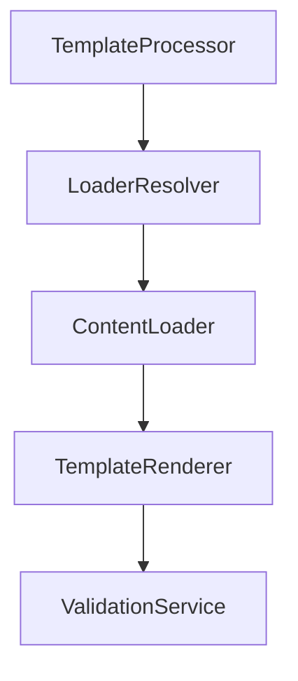
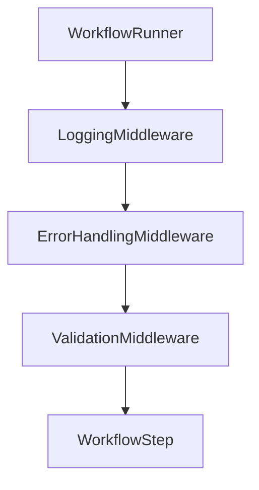
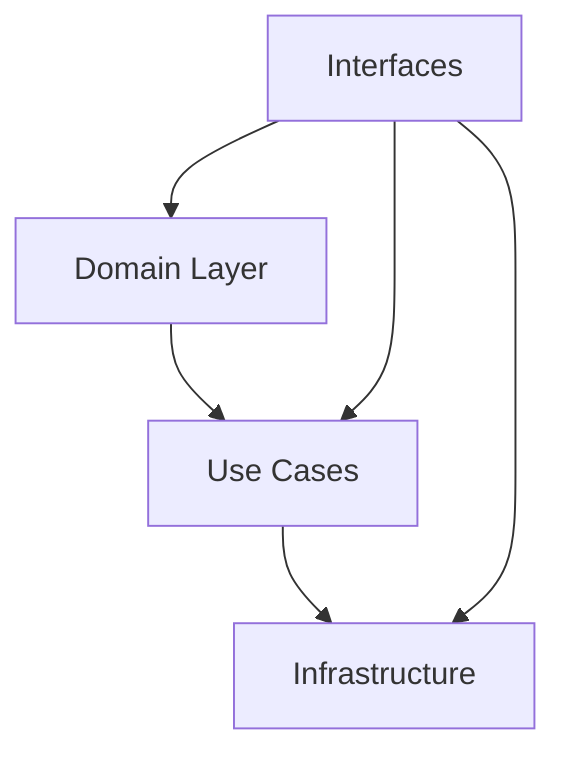

# Refactoring Analysis

## Progress Made

### ✅ Workflow Management Improvements
- Monolithic workflow.go split into focused step components
- Clear separation of concerns with individual step responsibilities
- Proper dependency injection in steps
- Consistent logging pattern across steps
- Step-based error handling

### ✅ Template Processing Improvements
- Extracted LoaderResolver into dedicated service
- Implemented clean resolver pattern with proper error handling
- Added robust logging and debugging capabilities

### ✅ Output Management Improvements
- Implemented two-phase output strategy (temp + finalize)
- Created focused steps for output management
- Added comprehensive error handling and cleanup
- Proper file permission handling

### ✅ Middleware Architecture Improvements
- Implemented WorkflowMiddleware interface
- Added middleware support in WorkflowRunner
- Clean handler chain implementation
- Proper middleware logging and error handling

## Remaining Issues

### 1. Architectural Concerns

#### Plugin System
- Plugin manager tightly coupled with concrete implementations
- Complex plugin loading logic mixed with validation
- No clear separation between plugin lifecycle and business logic
- Hard-coded plugin type checks

#### Error Handling
- Inconsistent error wrapping patterns
- Mixed use of custom errors and standard errors
- Lack of clear error hierarchy
- Missing error context in some cases

### 2. Design Pattern Improvements Needed

#### Process Template Step Refinement
- Template validation still needed
- Consider middleware for cross-cutting concerns
- Need abstraction for template processing pipeline

#### Dependency Management
- Still missing factory patterns for plugin creation
- Need IoC container for managing dependencies
- Consider builder pattern for complex step configuration

#### Interface Refinements
- Some interfaces are too broad (e.g., Template interface)
- Missing intermediate interfaces for better composability
- No clear boundary between domain and infrastructure interfaces

## Proposed Solutions

### 1. Next Architectural Improvements

#### Template Processing Pipeline


#### Middleware Architecture


#### Implement Clean Architecture Layers


### 2. Design Pattern Implementations

#### Factory Pattern for Plugin System
```go
// Example structure
type PluginFactory interface {
    CreateLoader(meta PluginMetadata) (LoaderPlugin, error)
    CreateHook(meta PluginMetadata) (HookPlugin, error)
}
```

#### Command Pattern for Workflow Steps
```go
type WorkflowStep interface {
    Execute(ctx *WorkflowContext) error
    Rollback(ctx *WorkflowContext) error
}
```

### 3. Next Refactoring Tasks

1. **Middleware Implementations**
   - Create validation middleware for config and steps
   - Implement error handling middleware with recovery
   - Add performance monitoring middleware
   - Create rollback coordination middleware

2. **Plugin System Improvements**
   - Implement plugin factory pattern
   - Create plugin lifecycle manager
   - Separate plugin discovery from plugin usage
   - Add plugin validation middleware

3. **Error Handling**
   - Implement error middleware pattern
   - Create structured error hierarchy
   - Add error context enrichment
   - Standardize error wrapping

4. **Middleware Interfaces**
```go
// Validation middleware
type ValidationMiddleware interface {
    WorkflowMiddleware
    AddValidator(validator StepValidator)
}

// Error handling middleware
type ErrorHandlingMiddleware interface {
    WorkflowMiddleware
    AddRecoveryHandler(handler RecoveryHandler)
}

// Performance monitoring
type MonitoringMiddleware interface {
    WorkflowMiddleware
    AddMetricsCollector(collector MetricsCollector)
}

// Rollback coordination
type RollbackMiddleware interface {
    WorkflowMiddleware
    RegisterRollbackHandler(step WorkflowStep, handler RollbackHandler)
}
```

5. **Integration Tests**
   - Add integration test suite
   - Implement test doubles for plugins
   - Add workflow step tests
   - Create error scenario tests

### Implementation Priority

1. ✅ Split monolithic workflow
2. ✅ Extract template processing pipeline
3. ✅ Implement output management
4. ✅ Implement middleware architecture
5. Implement specific middleware:
   - Validation middleware
   - Error handling middleware
   - Recovery middleware
6. Add workflow step rollback
7. Add comprehensive tests

### Benefits

- **Maintainability**: Smaller, focused components
- **Testability**: Clear boundaries and interfaces
- **Flexibility**: Easy to extend and modify
- **Reliability**: Better error handling and recovery
